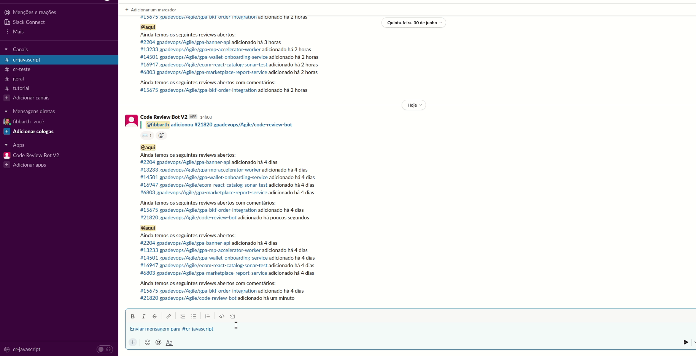

#  Code Review Bot


## Sobre o projeto
Bot para Code Review que controla as filas de MRs abertos do Azure e Gilab integrado com o Slack.

## Como funciona?
Para adicionar um MR a fila de CR, basta utilizar o slash command configurado para o bot junto com o link do MR.

Exemplo:


## Funcionalidades
- Adiciona `reactions` na mensagem do slack conforme likes do MR.
- Notifica canais de Code Review com MRs que estão abertos.
- Notifica nos canais de Code Review ranking de usuários que mais contribuíram com `likes` e `discussions`.

## Instalação

```
npm i
```

## Iniciando o projeto

### Setar as variáveis de ambiente

```
MONGO_URI
MONGO_COLLECTION_PREFIX
```

### Definir as configurações na Collection [PREFIX]_Settings

```
Exemplo de objeto de configuração

{
   "_id":{
      "$oid":"629695daa02fc72c1e31befd"
   },
   "cron":{
      "notifyRanking":{
         "enabled":true,
         "pattern":"0 0 9 * * 1"
      },
      "openRequests":{
         "enabled":true,
         "pattern":"0 0 8-18 * * 1-5",
         "hours":{
            "$numberInt":"2"
         }
      },
      "fetchRequestsUpdates":{
         "enabled":true,
         "pattern":"*/15 * * * * 1-5",
         "concurrence":{
            "$numberInt":"5"
         }
      }
   },
   "slack":{
      "reactions":{
         "discussion":"speech_balloon",
         "merged":"heavy_check_mark",
         "closed":"x"
      },
      "minUpvoters": 3, #Mínimo de likes necessários para aprovar o MR
      "log":{
         "enabled":false,
         "channelId":"ID_CANAL_LOG",
         "maxTextMessageSize":{
            "$numberInt":"1"
         }
      },
      "secret":"SLACK_SIGNING_SECRET",
      "token":"SLACK_TOKEN",
      "verificationToken":"SLACK_VERIFICATION_TOKEN",
      "webhookPath":"/webhook",
      "requestAddColor":"good",
      "allowedChannels":"CANAIS_SLACK" #separados por virgula e sem o # EX: cr-java,cr-js
   },
   "gitlab":{
      "host":"API_GILAB,
      "apiVersion":"v4",
      "personalToken":"PERSONAL_TOKEN"
   },
   "azure":{
      "host":"API_AZURE",
      "apiVersion":"5.0",
      "personalToken":"PERSONAL_TOKEN"
   },
   "__v":{
      "$numberInt":"0"
   }
}
```

### Rodando
```
npm run dev
```

## Configurando o Slack

[Passo a passo com as configurações do Slack](/documentation/setting-slack.md)
