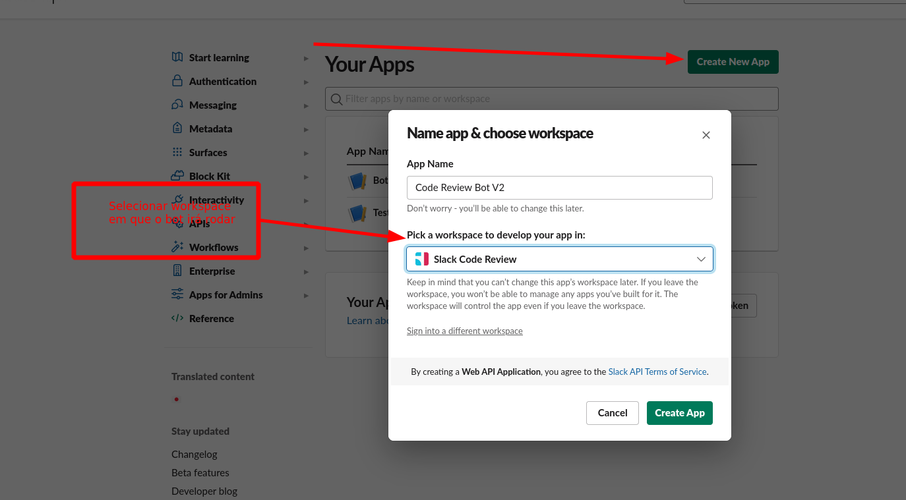

# Configurando o Slack

Passo a passo com as configurações necessárias para configurar o bot no slack

## Criando um novo Bot em uma Worskpace do Slack

### 1. Vá em https://api.slack.com/apps e clique em **Create New App**



### 2. Configurar o **Slash Command**, clicando em um dos links assinalados abaixo:


### 3. Adicionar o Slash Command ```/code-review``` conforme exemplo abaixo:


### 4. Instalar o Bot no Worspace


### 5. Configurar as permissões ```commands```, ```chat:write:bot```, ```emoji:read```, ```incoming-webhook```, ```reactions:read```, ```chat:write:user```, ```users:read```, ```channels:read```, ```groups:read```, ```mpim:read```, ```im:read``` e reinstalá-lo no Workspace


### 6. Adicionar o Bot aos canais de code review do Slack para que ele possa contabilizar as reações


### 7. Copiar os Tokens e Keys necessárias para configuração do Bot no Mongo


